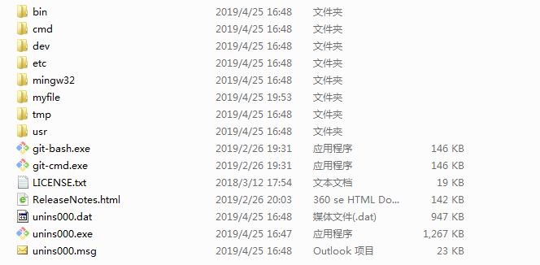
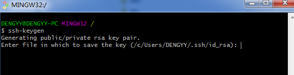
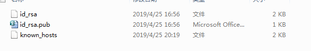
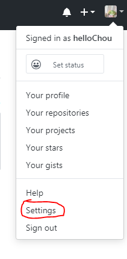
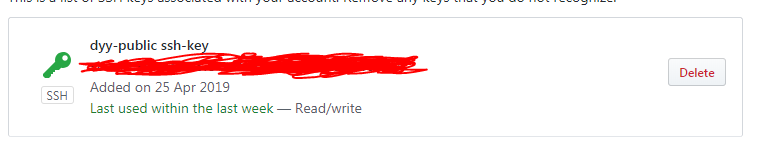
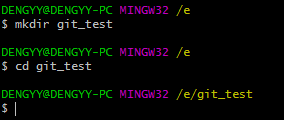
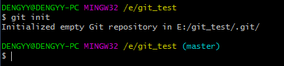
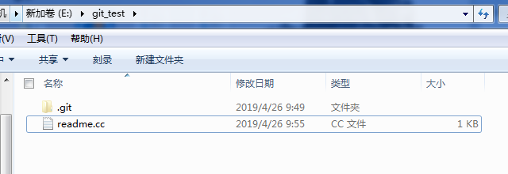
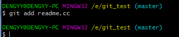
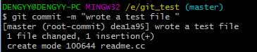

如何在本地创建一个版本库？

版本库(respository)相当于是一个目录，这个目录里面的所有文件都可以被Git管理，每个文件的修改、删除都会被Git记录下来，以便在未来的某个时间点可以看到之前任何一次修改、删除记录。

需要在本地下载Git软件，有三种不同的版本对应不同的平台：linux、Windsowx、macOS。

本文以windows为例。

## (1)下载Git

## (2)添加SSH公钥

下载Git完成安装后，打开安装目录文件Git，如下

由于本地的respository与github的respository之间是通过SSH加密的，因此需要设置SSH，设置步骤如下：

启动`git-bash.exe`，输入`ssh-keygen`，显示产生了一对RSA公钥和私钥，存放在文件`/c/User/DENGYY/.ssh/id_rsa`路径下。

打开`/c/User/DENGYY/.ssh`

其中id_ras.pub存放着SSH加密的公钥，以文本文件的形式打开并复制其中的公钥。

然后打开你的github页面，点击头像，点击settings。

找到`SSH and GPG keys`，点击`New SSH key`，将`id_ras.pub`存放着SSH加密的公钥添加到里面，完成。

## （3）在本地创建一个空Respository

打开`git-bash.exe`

首先创建一个空目录，我选择在/e盘下创建名为Git_test的空目录：

在git-bash.exe命令行中输入如下：

`mkdir git_test`

`cd git_test`

然后将git_test目录变成git可以管理的仓库：

`git init`

这里显示就是在git_test/.git路径下初始化了一个空Git仓库，到这里空仓库就建立好了，注意：.Git目录是进行跟踪管理版本库的，不能手动修改其内容！

## （4）将文件添加到本地respository中

首先利用notepad++写一个文档存入git_test目录下，注意要存放在git_test目录下！！

然后在git-bash.exe下用命令 `git add`，将文件添加到仓库

这里如果正确添加了是没有信息显示的。

然后用命令 `git commit`，将文件提交到仓库。

这里用的是 `git commit -m "wrote a test file"`

其中，-m 后面输入的是本次提交的说明，可以输入任何内容，最好是和这次提交的改动有关的信息，这样就可以在历史记录里方便找到这一次提交。

成功提交到仓库后，会返回如下内容：

`[master (root-commit) dea1a95]  worte a test file`

`1 file changed,1 insertion(+)` `//一个文件被改动，插入了一行内容`

这里需要说明一下为什么git添加文件需要`add`、`commit`两步？

因为`commit`一次可以提交很多文件，所以可以用`add`多次添加不同的文件。

其实也可以直接用 `git add .` ，这种加`.`的形式一次性将git_test目录下的所有文件都添加到respository中。

至此，本地库创建完成！

**PS：文本参考了网上很多教程，主要以廖雪峰的Git教程为主。**