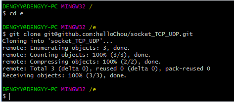
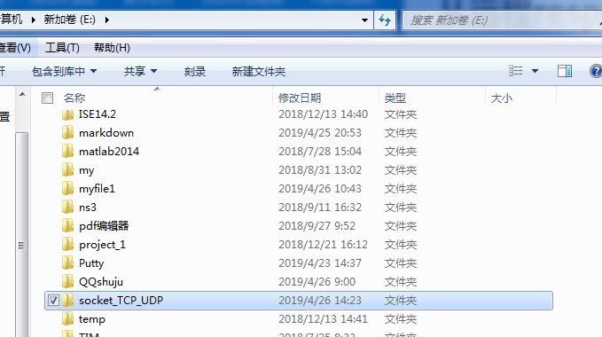

# 从远程respository克隆到本地respository

本节，我将github上的库—socket_TCP_UDP克隆到本地库中

打开`git-bash.exe`

首先跳转到想要放置远程库的目录下，这里我选择e盘，然后输入命令行：

`git clone git@github.com:helloChou/socket_TCP_UDP.git`

输出如上图，表示克隆完成，打开e盘可以看到出现一个文件目录：`socket_TCP_UDP`

打开该目录可以看到有github中`socket_TCP_UDP`库上的所有文件和一个`.git`本地库

完成clone！

PS：

在使用`git@github.com:helloChou/socket_TCP_UDP.git`默认采用的是SSH协议，但git本身还支持其他协议如HTTPS协议，因此也可些成 `https://github.com/helloChou/socket_TCP_UDP.git`;

SSH和HTTPS的区别：`https`的速度要比`ssh`慢，并且每次`push`都必须输入口令，但是在某些只开放`http`端口的公司内部无法使用`SSH`协议而只能使用`https`协议。