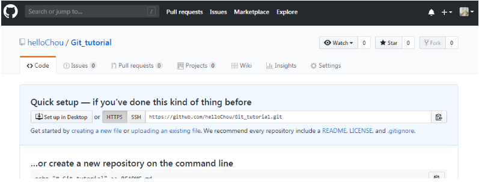
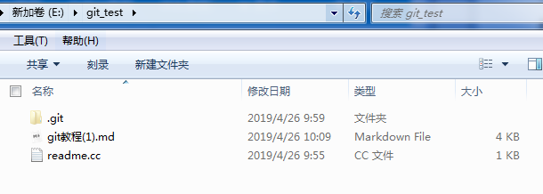
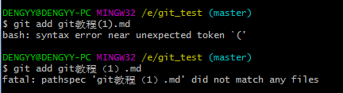
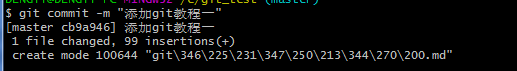
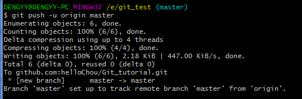
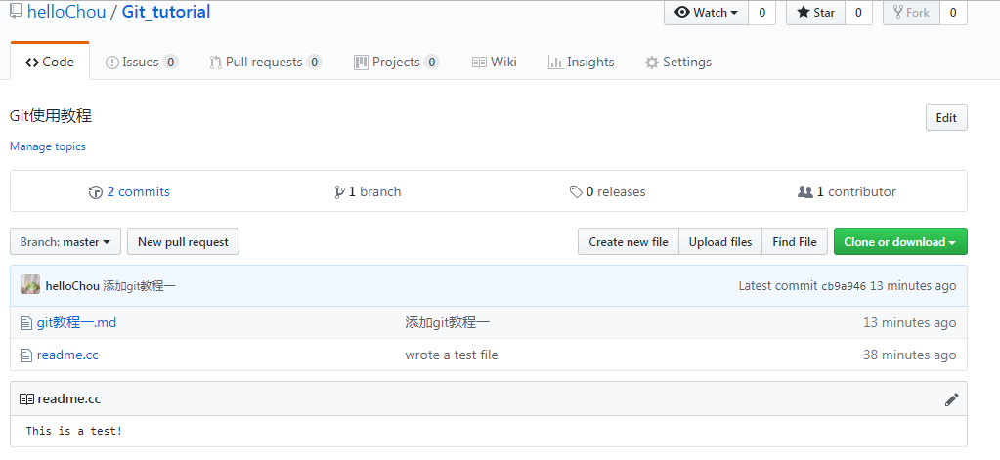

# 如何添加远程库

在上文中已经讲了如何安装Git以及创建一个本地respository，那么如何将本地respository中的内容同步到github上的respository中？同步到github上的respository的好处是github上的respository既可以作为备份，又可以让其他人通过该仓库在协作。

首先，打开github创建或打开一个想要和本地respository同步的respository。

显然，这里我的Git_tutorial是一个空respository。

接下来，我将git_test中的`git教程(1).md`添加到本地respository中，并与github上的Git_tutorial仓库同步。

首先将`git教程(1).md`放入git_test目录中

打开`git-bash.exe`，进入到`git_test`目录下，然后

注意：这里好像不能打括号()，显示输入错误：

因此，我将文件名改为`git教程一.md`,然后输入

`git add git教程一.md`

OK,到这里为止我们已经完成了将git教程一.md添加到本地respository中，接下来完成与github仓库同步。

输入：`git remote add origin git@github.com:helloChou/Git_tutorial.git` 完成**关联一个远程库**

这里的`git@github.com:helloChou/Git_tutorial.git`是我的Git_tutorial.git库的地址，这里也可以使用HTTPS的方式输入:`git remote add origin  https://github.com/helloChou/Git_tutorial`

`origin`是远程库的名字，这是Git的默认设定，可以自己修改成其它的名字

然后就是讲本地库的内容推送到远程库上去，输入

`git push -u origin master`

推送完成！

这里用的是 `git push` 命令，将当前分支 `master`推送到远程

由于远程库是空的，第一次推送`master`分支时，加上了`-u`参数，Git不但会把本地的`master`分支内容推送的远程新的`master`分支，还会把本地的`master`分支和远程的`master`分支关联起来，在以后的推送或者拉取时就可以简化命令。

然后我们去github上看一看：

这就能看到我们添加的git教程一了，**但是为什么还有一个readme.cc呢？**

这是因为在上一节教程中，我们将`readme.cc`也提交到了本地`respository`中，这里采用 git push的时候就将整个`master`分支的内容全部同步上去了。

小结：

要关联一个远程库，使用命令`git remote add origin git@github.com:helloChou/Git_tutorial.git` 

关联后，使用命令`git push -u origin master`第一次推送master分支的所有内容；

此后，每次本地提交后，只要有必要，就可以使用命令`git push origin master`推送最新修改；